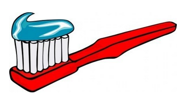
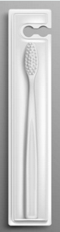
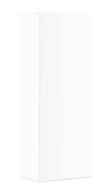
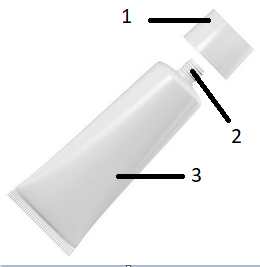
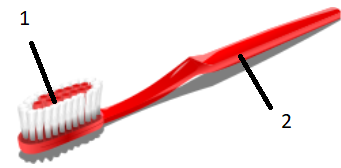

How to apply toothpaste onto a toothbrush

Table of Contents

I. Introduction

II. Prerequisites

III. Instructions

IV. Figures

I. Introduction
This manual provides instructions on how to apply toothpaste onto a toothbrush. It is an essential step for proper oral hygiene. Refer to the instructions and figures below to complete this procedure.

II. Prerequisites
In order to begin applying toothpaste onto a toothbrush, meet the following conditions:

1. Obtain a toothbrush and a toothpaste.
<!-- first note  -->
*Note: You can buy toothbrushes and toothpastes at supermarkets (usually found in the cosmetics aisle), pharmacies, or online. See Figures 1 and 2 for a visual reference.*

2. Open the outer packaging of the toothbrush and get the toothbrush out.

3. Repeat for the toothpaste.

III. Instructions
Follow the steps below to apply toothpaste onto a toothbrush.

1. Grab the toothpaste container (Figure 3) by the tube with one hand.

2. Grab the cap with the other hand and twist it counterclockwise to open the container.

*Note: If the toothpaste container is new, look for a tamper seal on the tube tip. If it's there, follow the manufacturer’s instructions on the packaging to remove the seal before continuing.*

3. Put away the cap.

4. Grab the toothbrush (Figure 4) by the handle.

5. Align the tube tip of the toothpaste container with the bristles of the toothbrush.

6. Gently squeeze the tube until a drop of toothpaste about the size of a pea is extracted through the tube tip onto the bristles of the toothbrush.

*Note: Toothpaste is a paste or gel dentifrice used to clean and keep the good appearance and health of teeth. It is an abrasive helps remove dental plaque and food residue from the teeth, assists in suppressing halitosis, and delivers active ingredients to help prevent tooth decay and gum disease.*

7. Close the tube by twisting the cap clockwise onto the tube tip.

IV. Figures

Figure 1. Toothbrush in packaging

Figure 2. Toothpaste in packaging

Figure 3. Toothpaste container. 1—cap; 2—tube tip; 3—tube

Figure 4. Toothbrush. 1—bristles; 2—handle

 
 